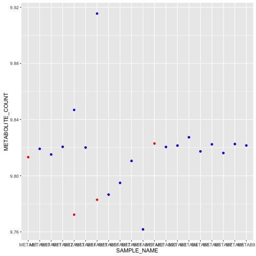
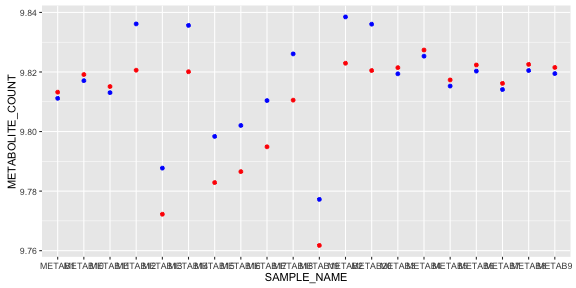
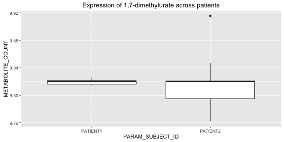

```
## Loading MetabolonR
```

```
## 
## Attaching package: 'dplyr'
```

```
## The following objects are masked from 'package:stats':
## 
##     filter, lag
```

```
## The following objects are masked from 'package:base':
## 
##     intersect, setdiff, setequal, union
```

This is a short vignette documenting how to load and manuiplate Metabolon data in `R`.

#The data

First we shall load three data frames that represent the sample metadata, metabolite metadata and the raw metabolite counts for each metabolite in each sample:


```
data(metaboliteDataWide)
data(metaboliteInfo)
data(sampleInfo)

```

The sample metadata contains information about the sample names, sample volume and when each sample was run (vital for the median normalisation). Here we display information about the dummy sample name, the subject id, the day the sample was run and the volume that was sent for analysis:


```r
data(sampleInfo)
knitr::kable(head(sampleInfo[,c("SAMPLE_NAME","PARAM_SUBJECT_ID","PARAM_RUN_DAY","PARAM_VOLUME_EXTRACTED_UL")], 10))
```


|SAMPLE_NAME |PARAM_SUBJECT_ID | PARAM_RUN_DAY| PARAM_VOLUME_EXTRACTED_UL|
|:-----------|:----------------|-------------:|-------------------------:|
|METAB1      |                 |             1|                        NA|
|METAB2      |                 |             2|                        NA|
|METAB3      |PATIENT1         |             1|                        95|
|METAB4      |PATIENT1         |             1|                        95|
|METAB5      |PATIENT1         |             1|                        95|
|METAB6      |PATIENT1         |             1|                        95|
|METAB7      |PATIENT1         |             1|                        95|
|METAB8      |PATIENT1         |             1|                        95|
|METAB9      |PATIENT1         |             1|                        95|
|METAB10     |PATIENT1         |             1|                        95|

The metabolite data frame contains meta information about the metabolites. This selection of data from the frame shows the package internal "Metabolite Name", the corresponding Biochemical name and the Mass of the metabolite as well as the platform used to detect the metabolite.


```r
data(metaboliteInfo)
knitr::kable(head(metaboliteInfo[,c("METABOLITE_NAME","BIOCHEMICAL","MASS","PLATFORM")], 10))
```


|METABOLITE_NAME |BIOCHEMICAL                     |     MASS|PLATFORM        |
|:---------------|:-------------------------------|--------:|:---------------|
|M1              |IS1                             | 186.1001|LC/MS Neg       |
|M2              |IS1                             | 318.4839|LC/MS Polar     |
|M3              |IS1                             | 243.9968|LC/MS Pos Late  |
|M4              |IS1                             | 205.1408|LC/MS Pos Early |
|M5              |1,2,3-benzenetriol sulfate (1)  | 204.9812|LC/MS Neg       |
|M6              |1,2,3-benzenetriol sulfate (2)  | 204.9812|LC/MS Neg       |
|M7              |1,2-dilinoleoyl-GPC (18:2/18:2) | 782.5694|LC/MS Pos Late  |
|M8              |1,2-dipalmitoyl-GPC (16:0/16:0) | 734.5694|LC/MS Pos Late  |
|M9              |1,2-distearoyl-GPC (18:0/18:0)  | 790.6320|LC/MS Pos Late  |
|M10             |1,3,7-trimethylurate            | 209.0680|LC/MS Neg       |

Finally, the `metaboliteDataWide` frame contains the actual count data. The first row denotes the `SAMPLE_NAME` and the remaining columns each metabolite and the corresponding counts in each sample.


```r
data(metaboliteDataWide)
knitr::kable(head(metaboliteDataWide[,1:4], 10))
```


|SAMPLE_NAME |        M1|        M2|        M3|
|:-----------|---------:|---------:|---------:|
|METAB1      | 467870464| 115746280| 143450320|
|METAB2      | 441669664|  98787336| 177866096|
|METAB3      | 473275648| 100677744| 147683328|
|METAB4      | 428544128| 108422176| 176024800|
|METAB5      | 442436608| 105664216| 155024736|
|METAB6      | 420502144|  84213496| 166350880|
|METAB7      | 445750368| 100167552| 136913024|
|METAB8      | 414519328|  90992536| 168648496|
|METAB9      | 431403168|  99685320| 149786992|
|METAB10     | 406344768|  87624672| 167539584|

The metabolites shown above show the counts in samples `METAB1` to `METAB10` for the internal standards labelled `M1`, `M2` and `M3`.

#The normalisation

We always want to start from the "raw" data. This gives us control over the normalisation and can provide a double check that the Metabolon normalisation is consistent with our understanding.

There are two stages to the normalisation.

##Volume Normalisation
The first is a simple volume normalisation that adjusts metabolite levels:


```r
metDataLong <- MetDataWideToLong(metaboliteDataWide)
volNormalised <- VolumeNormaliseDataset(cSampleInfo = sampleInfo, cMetInfo = metaboliteInfo , cMetDataLong = metDataLong, normalVolume = 95)

#convert bot to logs and plot
metDataLongLog10 <- TransformLog10Mets(dplyr::filter(metDataLong, METABOLITE_NAME=="M14"))
volNormalisedLog10 <- TransformLog10Mets(dplyr::filter(volNormalised, METABOLITE_NAME=="M14"))

plot <- ggplot2::ggplot()
plot <- plot + ggplot2::geom_point(data = metDataLongLog10, ggplot2::aes(x = SAMPLE_NAME, y = METABOLITE_COUNT), colour = "red")
plot <- plot + ggplot2::geom_point(data = volNormalisedLog10, ggplot2::aes(x = SAMPLE_NAME, y = METABOLITE_COUNT), colour = "blue")
plot <- plot + ggplot2::theme(legend.position="bottom")
plot
```




##Median Normalisation
The Metabolon normalisation normalises each count with reference to the global median of that particular metabolite. Each metabolite is scaled by the ratio of the median metabolite level for that run day divided by the global median.


```r
metDataLong <- MetDataWideToLong(metaboliteDataWide)
metDataLongLog10 <- TransformLog10Mets(metDataLong)
normalised <- MedianNormaliseDataset(cSampleInfo = sampleInfo, cMetLog10DataLong = metDataLongLog10, normaliseField = "PARAM_RUN_DAY", normaliseGroups = c(1,2))

knitr::kable(head(normalised))
```


|SAMPLE_NAME |METABOLITE_NAME | METABOLITE_COUNT|
|:-----------|:---------------|----------------:|
|METAB1      |M1              |         8.649820|
|METAB3      |M1              |         8.654797|
|METAB4      |M1              |         8.611779|
|METAB5      |M1              |         8.625602|
|METAB6      |M1              |         8.603571|
|METAB7      |M1              |         8.628835|

we can plot the difference in normalisation and raw data across samples for a single metabolite


```r
metDataLong <- MetDataWideToLong(metaboliteDataWide)
metDataLongLog10 <- TransformLog10Mets(metDataLong)
normalised <- MedianNormaliseDataset(cSampleInfo = sampleInfo, cMetLog10DataLong = metDataLongLog10, normaliseField = "PARAM_RUN_DAY", normaliseGroups = c(1,2))

unNormalised <- dplyr::filter(metDataLongLog10, METABOLITE_NAME=="M14")
normalised <- dplyr::filter(normalised, METABOLITE_NAME=="M14")

#join with the sample metadata
unNormalised <- dplyr::left_join(unNormalised, dplyr::select(sampleInfo, SAMPLE_NAME, PARAM_RUN_DAY), by="SAMPLE_NAME")
normalised <- dplyr::left_join(normalised, dplyr::select(sampleInfo, SAMPLE_NAME, PARAM_RUN_DAY), by="SAMPLE_NAME")

plot <- ggplot2::ggplot()
plot <- plot + ggplot2::geom_point(data = unNormalised, ggplot2::aes(x = SAMPLE_NAME, y = METABOLITE_COUNT), colour = "red")
plot <- plot + ggplot2::geom_point(data = normalised, ggplot2::aes(x = SAMPLE_NAME, y = METABOLITE_COUNT), colour = "blue")
plot <- plot + ggplot2::theme(legend.position="bottom")
plot
```



## Example visualisation

The end result is that we now have a normalised Metabolon dataset where we can now perform analytics on data, eg.


```r
patientNorm <- MedianNormaliseDataset(cSampleInfo = sampleInfo, cMetLog10DataLong = volNormalisedLog10, normaliseField = "PARAM_RUN_DAY", normaliseGroups = c(1,2))


patients <- dplyr::select(sampleInfo, SAMPLE_NAME, PARAM_SUBJECT_ID) %>% dplyr::filter(!(PARAM_SUBJECT_ID == ""))

patientNorm <- dplyr::left_join(patientNorm, patients, by = "SAMPLE_NAME")

#lookup the biochemical name for M14

biochemical <- metaboliteInfo[metaboliteInfo$METABOLITE_NAME == "M14",]$BIOCHEMICAL

p <- ggplot(patientNorm) + geom_boxplot(aes(x = PARAM_SUBJECT_ID, y = METABOLITE_COUNT))
p <- p + ggtitle(paste0("Expression of ", biochemical, " across patients"))
p
```



